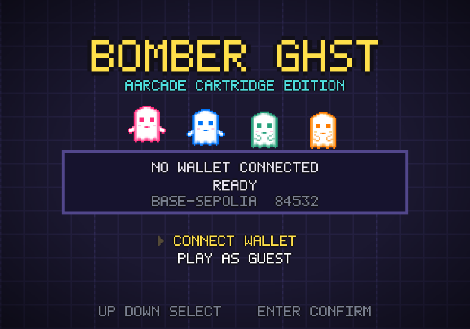
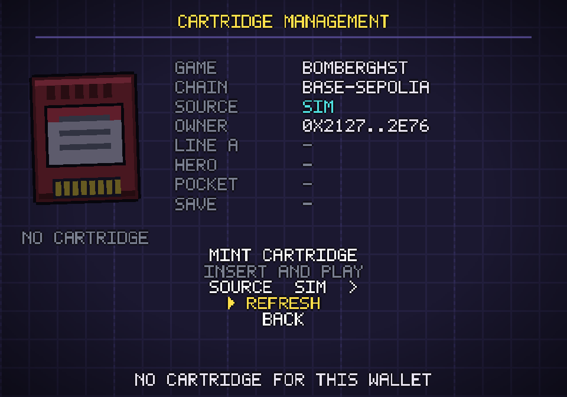
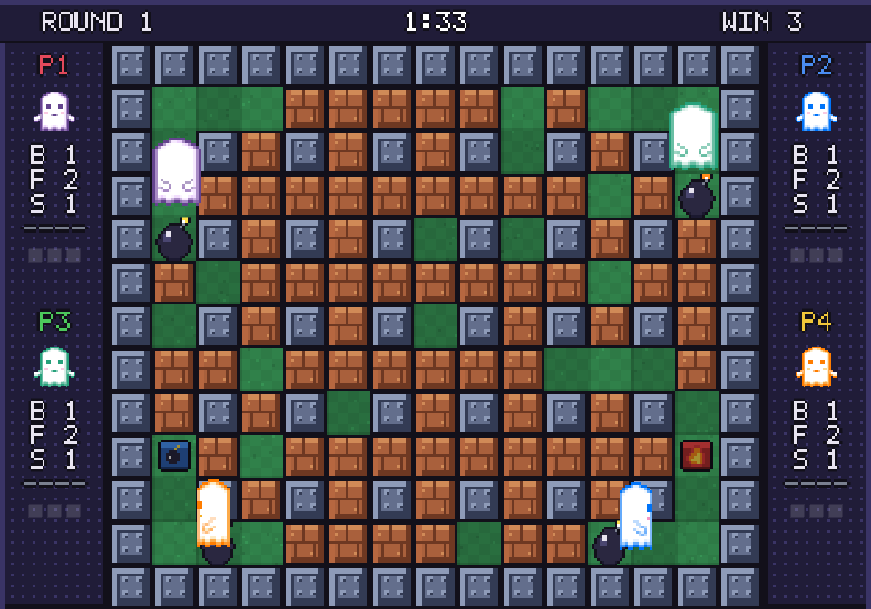

# BomberGhst

A Neo-Geo-flavoured Bomberman clone in Unity 2D, built as an Aarcade
cartridge game. Four ghost bombers, one 15x13 arena, destructible blocks,
chain explosions, power-ups, kickable bombs and a sudden-death block spiral
when the clock runs out - fronted by a wallet gate and a cartridge
management screen that talk to the Aarcade console and cartridge diamonds.

Presentation targets the Neo Geo's native **320x224** frame: 16px tiles, a
240x208 playfield, a 16px status bar and a 40px status panel on each side,
pillar/letterboxed to whatever window you give it.

| Title / wallet | Cartridges | Match |
|---|---|---|
|  |  |  |

## Screens

Three scenes, all of them empty assets: `Boot` reads the scene name and spawns
the matching screen, so there is nothing to wire up in the inspector.

| Scene | What it is |
|---|---|
| `Title` | Attract screen and wallet gate. Shows the Aarcade session if the shell supplied one, otherwise offers **CONNECT WALLET** or **PLAY AS GUEST**. |
| `Cartridge` | Cartridge management: what the connected wallet owns for `bomberghst`, and every operation the cartridge diamond exposes. |
| `Main` | The match: setup (players/bots), then play. `Esc` backs out to the cartridge screen. |

## Running it

Open the folder in Unity **6000.4.10f1** and press Play. Any scene works —
the game builds itself from code in `Boot.Launch`, so `Assets/Scenes/Main.unity`
is deliberately empty.

The bombers are Aavegotchis, built from the layered part PNGs that
Aavegotchi Paaint exports (see below). Everything else - blocks, bombs,
flames, pickups, the 5x7 font, the sound effects and the BGM - is still
generated procedurally at startup, and the game falls back to a drawn ghost
if the Aavegotchi sheet is absent, so it always runs standalone.

## Bomber sprites

`tools/build_gotchi_sprites.py` reads the 64x64 part PNGs from
`Aseprite-AavegotchiPaaint/PNGs/Base`, composites the poses the game needs,
halves them onto a 32px grid with a hard alpha cut so the art stays crisp, and
writes `Assets/Resources/GotchiSprites.png` plus a manifest. The output is
committed, so the Paaint repo is only needed when the art changes:

```sh
python3 tools/build_gotchi_sprites.py            # defaults to ~/Dev/Aseprite-AavegotchiPaaint
```

Six poses per player - hands open and closed for down and up, one side pose
mirrored for left, and a take-damage frame for the death animation. Eyes come
from the trait art rather than the base expressions: `--eye-shape` and
`--eye-color` default to **50/50**, the common band, and the exporter resolves
those to the right asset by reading the `Range_lo-hi` folder names, so other
trait values work without touching the script.

Every collateral gets a row in the sheet, because a cartridge with a bound
hero overrides its player's look: `CartridgeService` reports the bound hero's
collateral and haunt, and the local player wears that Aavegotchi instead of the
slot default. Paaint names haunt 1 art `ma*` and haunt 2 `am*` while a bound
hero carries the bare symbol, so `GotchiArt.RowFor` tries both prefixes and
falls back to the slot default when nothing matches.

Unbound cartridges and the bots use these four defaults, picked so they read
apart on a dark playfield:

| Slot | Collateral | Accent |
|---|---|---|
| P1 | maUNI | `#ff2a7a` |
| P2 | maYFI | `#0074f9` |
| P3 | maUSDT | `#26a17b` |
| P4 | maDAI | `#ff7d00` |

The sprites are pivoted at the feet and stand about 1.6 tiles tall, so a bomber
overlaps the tile above it the way a Neo Geo sprite should.

## Controls

| | Move | Bomb |
|---|---|---|
| Player 1 | `WASD` (also arrows in 1-player games) | `Space` / `Left Shift` |
| Player 2 | Arrow keys | `Right Shift` / `Enter` |

`Enter` confirms on the title screen and skips result screens. `Esc` pauses;
a second `Esc` quits to the title.

On the title screen `A`/`D` (or left/right) set the number of humans and
`W`/`S` (or up/down) the number of bots, up to four bombers total.

## Wallet and session

The shipping target is WebGL inside the Aarcade GameViewer, so the session
arrives from the shell rather than from a wallet connect flow in the game.
The protocol is the same one the other Aarcade titles use, so no shell change
is needed:

- the page parks the session on `window.__AARCADE_PENDING_SESSION`, or calls
  `SendMessage('AarcadeBridge', 'SetSession', json)` once the player boots;
- the payload is `{ sessionToken, sessionId, gameId, playerId, gameType,
  cartridgeId, cartridgeSim }`, where `playerId` is the wallet address;
- once applied, the game calls back out through
  `window.AarcadeBridge.OnWalletReady(address)`.

When no session shows up, **CONNECT WALLET** asks the page provider directly
(`window.AarcadeChain.provider` if the shell injected one, else
`window.ethereum`). Outside WebGL there is no provider at all, so the same
option connects a local dev wallet against the JSON fixture instead.

## Cartridges

Cartridge state has two back ends behind one `ICartridgeProvider` seam, plus an
offline fixture. **SIM is the live one today**; the chain path is the migration
target and is already wired and verified. `SOURCE` on the cartridge screen
cycles between them, so the migration can be exercised with one keypress.

| Source | What answers | Status |
|---|---|---|
| `SIM` | `cartridge.aarcadeghst.com` through the home tunnel | live, the default |
| `CHAIN` | console + cartridge diamonds on Base Sepolia | ready, waiting on the testnet cartridges |
| `FIXTURE` | `Resources/BomberGhstCartridges.json` | offline, for the editor |

### SIM

On the Aarcade site the game is same origin, so requests go to
`/api/cartridge-sim`, which Vercel rewrites to the home tunnel; off the site
the host is called directly. `PlayerPrefs("cartridge.api")` overrides both.

Endpoints used: `GET /cartridges?owner=&gameId=`, `GET /cartridges/{id}`,
`POST /cartridges/ensure`, `/pay-line-a`, `/bind-owned`, `/bind-starter` and
`/checkpoint`. Reads are open; every write needs the Aarcade session token, and
the SIM holds the minter authority, so unlike the chain path **a player really
can mint their own cartridge here**.

A SIM checkpoint is signed: the backend rebuilds the message from the state it
receives and recovers the signer against the cartridge owner, so the game
hashes the save with **SHA-256** over `JSON.stringify(state, sortedKeys)` and
signs

```
Aarcade cartridge checkpoint
cartridgeId: <id>
nonce: <n>
stateHash: 0x<sha256>
```

with `personal_sign`. This is deliberately not the same as the on-chain
checkpoint, which stores a **keccak256** hash and uses `Cartridge:`/`Nonce:`/
`State:` labels. `CheckpointCrypto` implements both and the self test pins each
against the reference implementation.

### On-chain (migration target)

Reads go over plain JSON-RPC so they work in the editor and in the browser;
anything needing a signature goes to the page wallet. Addresses default to
`config/cartridgeChain.base-sepolia.json` from the AarcadeGh-t repo and can be
repointed at runtime through `PlayerPrefs` (`chain.rpc`, `chain.console`,
`chain.cartridge`, `chain.id`, `chain.network`).

| | |
|---|---|
| Chain | Base Sepolia (84532) |
| Console diamond | `0x4c4fa38420c457c5a5a33beebd6f340618e62f8a` |
| Cartridge diamond | `0xbb44b67de78393a54bcda56707e6ffc719b3a645` |
| Game id | `bomberghst` -> `keccak256` -> `0xc73acbd1...9bd1e` |

Views used: `playerCartridge(bytes32,address)` on the console, then `ownerOf`,
`getGameId`, `lineAPaid`, `getActiveHeroId`, `heroIds`, `pocketBalance` and
`getCheckpoint` on the cartridge. Writes: `mintCartridge`, `payLineA`,
`bindStarter`, `bindOwned` and `checkpointSave`.

A checkpoint commits the local play record (matches, round wins, bombs placed,
sudden deaths) as `keccak256` over its JSON, matching the hash the web SDK
writes, so a checkpoint made here verifies the same way there.

There is no ethers or web3 dependency: `Assets/Scripts/Chain` contains a
Keccak-256, an ABI encoder/decoder and a JSON-RPC client. **BomberGhst > Run
Chain Self Test** pins all of it, plus the SIM checkpoint crypto, against
vectors taken from `cast` and from `lib/cartridgeSim.cjs` run under node.

Open items for the move onto Base Sepolia - including why a chain-sourced
cartridge cannot yet show its bound gotchi - are collected in
[docs/CHAIN_MIGRATION.md](docs/CHAIN_MIGRATION.md).

### Known limits

- On chain, `mintCartridge` is gated to the protocol multisig and authorized
  minters, so minting from a player wallet reverts with `Console: !minter`.
  This is exactly why minting goes through the SIM backend today; the action is
  wired up on both sources and reports the revert rather than pretending.
- `bindOwned` checks ownership through the L1 Aavegotchi diamond, which is
  blank in the Base Sepolia config, so **BIND OWNED GOTCHI** will revert until
  that address is set. **BIND STARTER GOTCHI** works, at the contract's
  hardcoded 5 ETH `STARTER_BIND_FEE`.
- The diamond exposes no getter for a cartridge's Line A fee, so the amount
  **PAY LINE A** sends comes from `PlayerPrefs("chain.lineAWei")`, default 0.
  Games with no mint fee already report `lineAPaid`, so the action is hidden.

## Rules

- Last ghost standing wins the round; first to **3** round wins takes the match.
- Blocks under a blast drop their hidden power-up:
  **Fire** (+1 blast range), **Bomb** (+1 bomb), **Speed** (+1 move speed),
  **Kick** (walk into a bomb to send it sliding).
- Bombs caught in a blast detonate immediately, so chains are free kills.
- When the 99 second clock expires, **sudden death** starts: indestructible
  blocks slam down in an inward spiral, flattening anything under them.

## Layout

```
Assets/Scripts/Chain/
  Keccak.cs      keccak-256, for selectors and game id hashes
  Hex.cs         hex and big integer helpers
  Abi.cs         ABI encoder plus a word-wise decoder
  JsonRpc.cs     eth_call over UnityWebRequest
  ChainConfig.cs addresses, chain id, RPC, overridable via PlayerPrefs
  WalletBridge.cs signing path through the page provider
Assets/Scripts/Aarcade/
  AarcadeBridge.cs  GameViewer session payload and wallet-ready callback
Assets/Scripts/Cartridges/
  CartridgeSnapshot.cs  the cartridge as the game sees it
  ICartridgeProvider.cs coroutine shaped provider seam
  SimApi.cs             HTTP client for the cartridge SIM
  SimCartridgeProvider.cs  the live SIM back end
  CheckpointCrypto.cs   stable stringify, sha256, both message formats
  ChainCartridgeProvider.cs  the console and cartridge diamonds
  FixtureCartridgeProvider.cs  offline stand-in for editor and desktop
  CartridgeService.cs   session, active cartridge, all the operations
  Progress.cs           the local play record a checkpoint commits
Assets/Scripts/Screens/
  RetroScreen.cs   shared 320x224 screen plumbing
  MenuList.cs      keyboard menu with a caret
  TitleScene.cs    attract screen and wallet gate
  CartridgeScene.cs cartridge management
  SceneFlow.cs     scene names and navigation
Assets/Plugins/WebGL/
  AarcadeBridge.jslib  pending session read, wallet ready callback
  AarcadeChain.jslib   provider.request bridge for signing
Assets/Scripts/Core/
  Config.cs      tuning constants, palette, tile<->world maths
  GotchiArt.cs   slices the Aavegotchi sheet, falls back to the drawn ghost
  Pix.cs         tiny CPU raster canvas (every sprite is drawn with it)
  Art.cs         the sprite library, generated and cached on first use
  PixelFont.cs   5x7 bitmap font -> sprite
  Label.cs       a GameObject that renders one line of that font
  Sfx.cs         synthesised sound effects and the looping BGM
  Boot.cs        RuntimeInitializeOnLoad entry point
  DemoMode.cs    command line flags (attract mode, screenshots)
Assets/Scripts/Game/
  GameDirector.cs  match state machine: title, rounds, sudden death, results
  Arena.cs         tile grid, level generation, explosions, sudden death
  Bomber.cs        movement, collision with corner assist, stats, death
  Brains.cs        keyboard input, and the bot's danger map + BFS planner
  Bomb.cs          fuse, chaining, kicking
  Flame.cs         blast visuals
  PowerUp.cs       pickups
  Hud.cs           status bar, player cards, callouts, title screen
  Letterbox.cs     keeps the 320x224 aspect at any window size
Assets/Editor/
  ProjectSetup.cs  scene + player settings, and the batch build entry point
  GotchiTextureImporter.cs  keeps the sprite sheet point filtered and uncompressed
tools/
  build_gotchi_sprites.py   Aavegotchi Paaint parts -> the bomber sheet
```

The bots read a danger map built from every live bomb's blast footprint, then
run a BFS over the grid to either flee, plant a bomb they can escape, or walk
to the nearest pickup, destructible block or opponent.

## Building

From the Unity menu: **BomberGhst > Set Up Project**, then build normally.
**BomberGhst > Run Chain Self Test** checks the chain layer against the
foundry reference vectors.

WebGL is the shipping target. The build lands in `Builds/bomberghst/Build`,
Brotli compressed and named for the game slug, which is what the Aarcade site
expects under `public/games/bomberghst/Build`:

```sh
"/Applications/Unity/Hub/Editor/6000.4.10f1/Unity.app/Contents/MacOS/Unity" \
  -batchmode -nographics -quit -projectPath . \
  -executeMethod BomberGhst.EditorTools.ProjectSetup.BuildWebGL
```

The `.br` files need `Content-Encoding: br` declared for them in the site's
`vercel.json`, the same way the other games do it.

Headless macOS build:

```sh
"/Applications/Unity/Hub/Editor/6000.4.10f1/Unity.app/Contents/MacOS/Unity" \
  -batchmode -nographics -quit -projectPath . \
  -executeMethod BomberGhst.EditorTools.ProjectSetup.BuildMac
```

## Command line flags

Useful for attract loops and for testing the build without a keyboard:

| Flag | Effect |
|---|---|
| `-autoplay` | four bots, match starts and restarts itself |
| `-mute` | silence music and effects |
| `-roundtime <sec>` | override the 99 second round clock |
| `-shot <dir>` | write a PNG screenshot periodically |
| `-shotevery <sec>` | screenshot interval (default 4) |
| `-exitafter <sec>` | quit after this many seconds |
| `-scene <name>` | boot straight into `Title`, `Cartridge` or `Main` |
| `-devwallet [addr]` | connect a dev wallet at boot, no browser needed |
| `-source <name>` | `sim`, `chain` or `fixture` |
| `-cartridgetest <id>` | read one cartridge off chain, log it, quit |

```sh
Builds/BomberGhst.app/Contents/MacOS/BomberGhst -autoplay -roundtime 20
```

The player can also be exercised with no window at all, which is how the
match loop was smoke tested. Pass `-mute` when you do: Unity's headless audio
device tears the player down after a minute or so of continuous playback.

```sh
Builds/BomberGhst.app/Contents/MacOS/BomberGhst \
  -batchmode -nographics -autoplay -mute -roundtime 3 -exitafter 90
```
